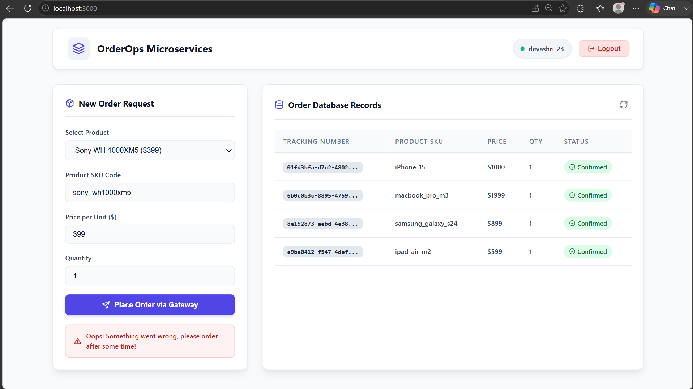
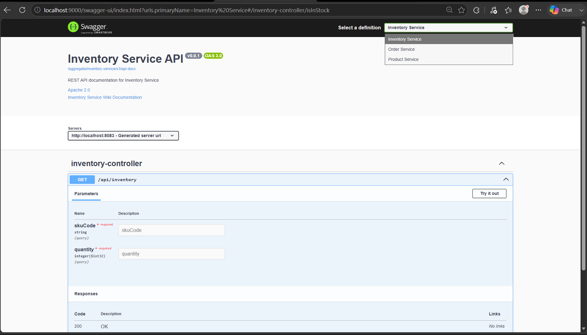
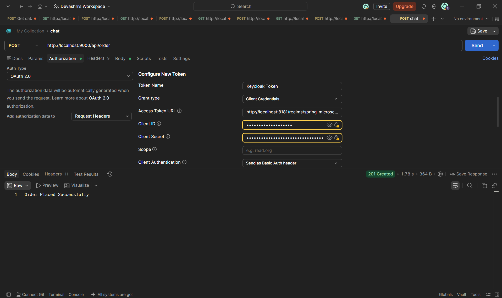
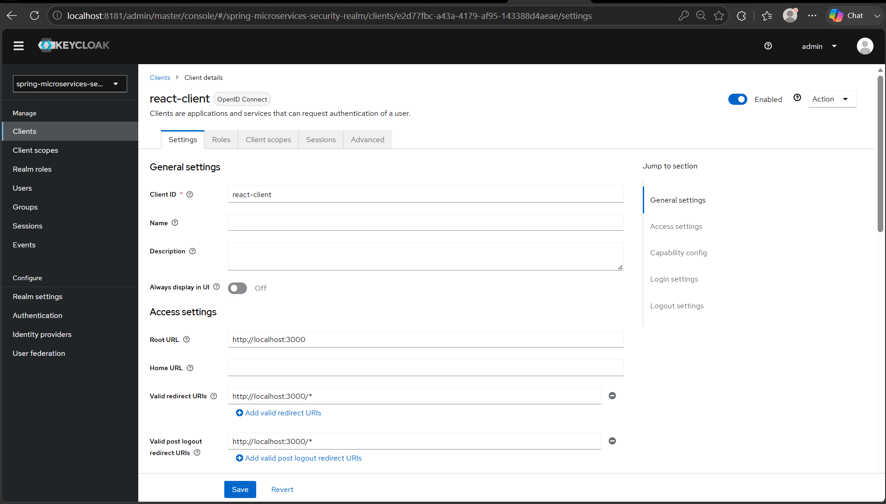
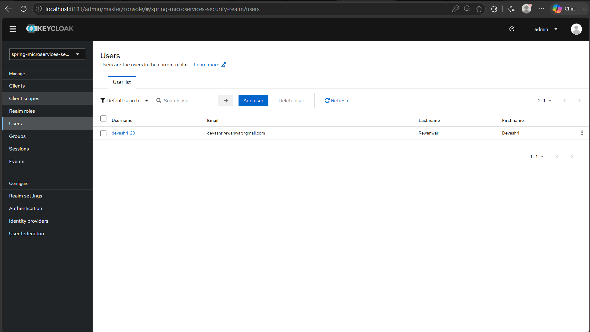
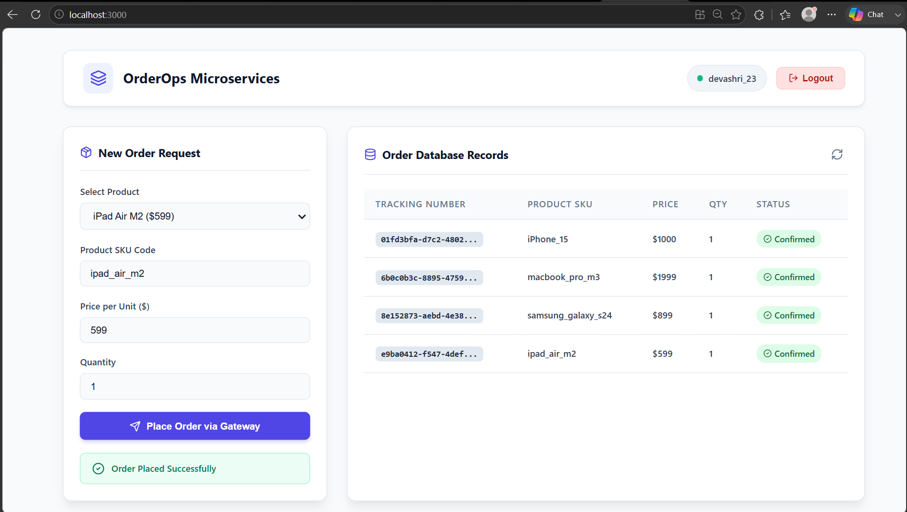
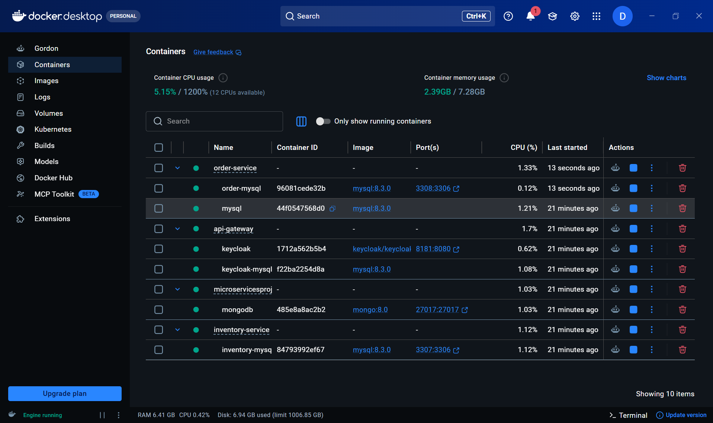

# ⚡ OrderOps — Enterprise E-Commerce Microservices Platform

<p align="center">

**A production-style e-commerce order management system built with Java, Spring Boot, Spring Cloud Gateway, Keycloak, Resilience4j, MySQL, MongoDB, Docker and React.**

Designed to demonstrate **microservices architecture, secure API communication, fault tolerance, independent data ownership, database migrations, API aggregation and containerized development.**

</p>

<p align="center">


</p>

---

## 📌 Why This Project?

OrderOps was built to simulate how a real-world e-commerce backend can be decomposed into independently responsible services.

Instead of implementing the entire application as a single monolith, the system separates major business capabilities into dedicated services:

```text
                         ┌──────────────────┐
                         │    Keycloak IAM   │
                         │   OAuth2 / OIDC   │
                         └────────┬─────────┘
                                  │ JWT
                                  ▼
┌───────────────┐          ┌──────────────────┐
│ React Frontend│ ────────▶│  API Gateway     │
│    :3000      │   HTTP   │      :9000        │
└───────────────┘          └────────┬─────────┘
                                    │
                 ┌──────────────────┼──────────────────┐
                 │                  │                  │
                 ▼                  ▼                  ▼
        ┌────────────────┐ ┌────────────────┐ ┌────────────────┐
        │ Order Service  │ │Inventory       │ │Product Service │
        │    :8081       │ │Service :8083   │ │    :8080       │
        └───────┬────────┘ └───────┬────────┘ └───────┬────────┘
                │                  │                  │
                ▼                  ▼                  ▼
           ┌─────────┐        ┌─────────┐        ┌─────────┐
           │ MySQL   │        │ MySQL   │        │ MongoDB │
           │ orderdb │        │inventory│        │productdb│
           └─────────┘        └─────────┘        └─────────┘
```

The project focuses particularly on **security, service-to-service communication and failure handling** — areas that are important when designing distributed backend systems.

---

# 🚀 Core Features

### 🔐 Secure Authentication & Authorization

* Keycloak Identity and Access Management
* OAuth 2.0 / OpenID Connect
* JWT-based authentication
* Role-based access control
* PKCE-based frontend authentication flow
* Spring Security resource-server integration

### 🌐 API Gateway

* Spring Cloud Gateway
* Centralized API entry point
* Request routing
* Security integration
* CORS configuration
* Service abstraction from the frontend
* Aggregated Swagger/OpenAPI documentation

### 🛡️ Resilience & Fault Tolerance

Implemented using **Resilience4j**:

* Circuit Breaker
* TimeLimiter
* Fallback handling
* Downstream failure protection

When the Inventory Service becomes unavailable, the Order Service does not continuously wait for the failing dependency. The circuit breaker protects the application and returns a controlled fallback response.

### 🔄 Inter-Service Communication

The Order Service communicates with the Inventory Service using Spring `WebClient`.

```text
Client
   │
   ▼
API Gateway
   │
   ▼
Order Service
   │
   │ WebClient
   ▼
Inventory Service
   │
   ▼
Stock Validation
```

### 🗄️ Database-per-Service

Each microservice owns its own persistence layer.

```text
Order Service       → MySQL
Inventory Service   → MySQL
Product Service     → MongoDB
```

Services do not directly access another service's database.

### 🗃️ Database Migration

Flyway is used for version-controlled database schema migrations.

```text
V1__initial_schema.sql
V2__add_order_status.sql
V3__...
```

This makes database changes repeatable and easier to manage across environments.

### 🐳 Containerized Infrastructure

Docker Compose is used to run the required infrastructure consistently during local development.

### 📚 API Documentation

Swagger/OpenAPI documentation is exposed through the API Gateway so developers can explore service APIs from a centralized entry point.

---

# 🏗️ Architecture

## High-Level Architecture

The system follows a layered distributed architecture:

```text
                    ┌─────────────────┐
                    │    Keycloak     │
                    │ Authentication  │
                    └────────┬────────┘
                             │
                             │ JWT
                             ▼
┌─────────────┐       ┌──────────────────┐
│   React     │──────▶│ Spring Cloud     │
│  Frontend   │ HTTP  │ Gateway :9000    │
└─────────────┘       └────────┬─────────┘
                               │
                 ┌─────────────┼─────────────┐
                 │             │             │
                 ▼             ▼             ▼
          ┌───────────┐ ┌───────────┐ ┌───────────┐
          │   Order   │ │ Inventory │ │  Product  │
          │  :8081    │ │   :8083   │ │   :8080   │
          └─────┬─────┘ └─────┬─────┘ └─────┬─────┘
                │             │             │
                ▼             ▼             ▼
             MySQL          MySQL         MongoDB
```

---

# 🔄 Order Processing Flow

A typical order request follows this flow:

```text
1. User authenticates through Keycloak
                    ↓
2. React receives access token
                    ↓
3. React sends authenticated request
                    ↓
4. API Gateway validates/routes request
                    ↓
5. Order Service receives order
                    ↓
6. Order Service calls Inventory Service
                    ↓
7. Inventory validates stock
                    ↓
8. Order Service persists order
                    ↓
9. Response returned through Gateway
                    ↓
10. React displays confirmed order
```

### Successful Request

```text
React
  ↓
Gateway
  ↓
Order Service
  ↓
Inventory Service
  ↓
Stock Available
  ↓
Order Saved
  ↓
HTTP Response
  ↓
React Dashboard
```

---

# 🧩 Microservices

## 1. API Gateway

**Port:** `9000`

The API Gateway acts as the single entry point into the backend.

### Responsibilities

* Route requests to appropriate services
* Centralize cross-cutting concerns
* Integrate with Spring Security
* Handle CORS
* Hide internal service endpoints from clients
* Expose aggregated API documentation

```text
Client → Gateway → Internal Services
```

---

## 2. Order Service

**Port:** `8081`

The Order Service manages the order lifecycle.

### Responsibilities

* Create orders
* Validate order requests
* Communicate with Inventory Service
* Persist order information
* Apply Resilience4j protection
* Handle downstream failures
* Manage database migrations with Flyway

### Order flow

```text
Create Order
     ↓
Validate Request
     ↓
Check Inventory
     ↓
Persist Order
     ↓
Return Response
```

---

## 3. Inventory Service

**Port:** `8083`

The Inventory Service owns stock-related operations.

### Responsibilities

* Maintain inventory quantities
* Validate stock availability
* Retrieve stock information
* Update inventory
* Expose inventory REST APIs

The Order Service communicates with this service instead of directly accessing the inventory database.

---

## 4. Product Service

**Port:** `8080`

The Product Service manages the product catalog.

### Responsibilities

* Product creation
* Product retrieval
* Product catalog management
* MongoDB persistence

MongoDB is used to demonstrate document-oriented persistence for catalog data.

---

## 5. React Frontend

**Port:** `3000`

The React application provides the user-facing dashboard.

### Responsibilities

* Authentication
* Order creation
* Product interaction
* API communication
* Order status display
* Error/fallback notifications
* Dashboard presentation

---

# 🔐 Security Architecture

Keycloak acts as the centralized Identity Provider.

```text
┌───────────────┐
│ React Client  │
└───────┬───────┘
        │
        │ Login
        ▼
┌───────────────┐
│   Keycloak    │
│    :8181      │
└───────┬───────┘
        │
        │ Access Token
        ▼
┌───────────────┐
│ React Client  │
└───────┬───────┘
        │
        │ Bearer JWT
        ▼
┌──────────────────┐
│   API Gateway    │
└────────┬─────────┘
         │
         ▼
 Protected Microservices
```

### Security technologies

* Keycloak
* Spring Security
* OAuth2
* OpenID Connect
* JWT
* PKCE
* Role-based access control

---

# 🛡️ Resilience4j Circuit Breaker

One of the key engineering features of OrderOps is downstream failure protection.

### Without Circuit Breaker

```text
Order Service
     │
     ▼
Inventory Service ❌
     │
     ▼
Repeated Requests
     │
     ▼
Slow Responses
     │
     ▼
Resource Exhaustion
     │
     ▼
Potential Cascading Failure
```

### With Circuit Breaker

```text
Order Service
     │
     ▼
Circuit Breaker
     │
     ▼
Inventory Service ❌
     │
     ▼
Fallback Response
```

### Circuit Breaker States

```text
              ┌─────────┐
              │ CLOSED  │
              └────┬────┘
                   │
             Failure threshold
                   │
                   ▼
              ┌─────────┐
              │  OPEN   │
              └────┬────┘
                   │
             Wait duration
                   │
                   ▼
             ┌───────────┐
             │ HALF-OPEN │
             └─────┬─────┘
                   │
            Test request
              ┌────┴────┐
              │         │
           Success    Failure
              │         │
              ▼         ▼
           CLOSED      OPEN
```

---

# 🧪 Circuit Breaker Demonstration

The failure-handling mechanism can be demonstrated directly from the application.

### Normal operation

When Inventory Service is running:

```text
Order Request
     ↓
Order Service
     ↓
Inventory Service
     ↓
Stock Validation
     ↓
Order Created
```

### Inventory failure

When Inventory Service is stopped:

```text
Order Request
     ↓
Order Service
     ↓
Circuit Breaker
     ↓
Inventory Service ❌
     ↓
Fallback Handler
     ↓
Controlled Error Response
```

### Application screenshot



The application displays a controlled fallback message rather than exposing an unhandled backend exception.

---

# 📚 Swagger API Documentation

OrderOps provides centralized API documentation through Swagger/OpenAPI.



The Gateway provides a single location from which developers can discover and test APIs exposed by the microservices.

This avoids requiring developers to remember separate Swagger URLs for every service.

---

# 🧪 API Testing with Postman

Postman was used to test backend REST APIs and verify service-to-service functionality.



Testing includes:

* REST endpoint validation
* Request/response verification
* HTTP status code validation
* Order API testing
* Inventory API testing
* Authentication-aware requests

---

# 🔑 Keycloak Configuration

The project uses Keycloak for centralized authentication and authorization.

### Client Configuration



### User Configuration



The frontend authenticates through Keycloak and uses the resulting access token when communicating with protected backend APIs.

---

# 🖥️ Application Dashboard



The dashboard provides the primary user interface for interacting with the OrderOps platform.

It demonstrates:

* Order creation
* Order information
* Confirmed orders
* Backend API integration
* Authentication
* Error handling

---

# 🐳 Docker Environment



Docker is used to provide a reproducible local development environment for the application's infrastructure.

The environment can be started using:

```bash
docker compose up -d
```

Check running containers:

```bash
docker ps
```

Stop the environment:

```bash
docker compose down
```

---

# 🗄️ Data Architecture

OrderOps follows a **database-per-service** approach.

```text
┌────────────────────┐
│   Order Service    │
└─────────┬──────────┘
          │
          ▼
       MySQL
      orderdb


┌────────────────────┐
│ Inventory Service  │
└─────────┬──────────┘
          │
          ▼
       MySQL
    inventorydb


┌────────────────────┐
│  Product Service   │
└─────────┬──────────┘
          │
          ▼
      MongoDB
      productdb
```

### Why database-per-service?

This architecture provides:

* Data ownership
* Reduced coupling
* Independent schema evolution
* Better service boundaries
* Independent persistence technology choices

A service never directly accesses another service's database.

---

# 🗃️ Flyway Database Migrations

Database schema changes are managed using Flyway.

Example:

```text
src/main/resources/db/migration/

V1__initial_schema.sql
V2__add_order_status.sql
V3__add_customer_reference.sql
```

Flyway ensures that database changes can be versioned and applied consistently.

---

# 🧰 Technology Stack

| Category                    | Technology                  |
| --------------------------- | --------------------------- |
| Programming Language        | Java 17+                    |
| Backend Framework           | Spring Boot 3               |
| Web                         | Spring MVC / WebFlux        |
| Microservices               | Spring Boot                 |
| API Gateway                 | Spring Cloud Gateway        |
| Security                    | Spring Security             |
| IAM                         | Keycloak                    |
| Authentication              | OAuth2 / OpenID Connect     |
| Authorization               | JWT / RBAC                  |
| Inter-Service Communication | WebClient / REST            |
| Fault Tolerance             | Resilience4j                |
| Relational Database         | MySQL 8.3                   |
| NoSQL Database              | MongoDB 8.0                 |
| ORM                         | Spring Data JPA / Hibernate |
| Database Migration          | Flyway                      |
| Frontend                    | React 18                    |
| HTTP Client                 | Axios                       |
| API Documentation           | Swagger / OpenAPI           |
| API Testing                 | Postman                     |
| Containerization            | Docker / Docker Compose     |
| Build Tool                  | Maven                       |
| Version Control             | Git / GitHub                |

---

# 📂 Project Structure

```text
Microservices Project/
│
├── api-gateway/
│
├── order-service/
│
├── inventory-service/
│
├── product-service/
│
├── order-frontend/
│
├── frontend/
│
├── assets/
│   ├── Architecture.png
│   ├── circuit-breaker.png
│   ├── dashboard.png
│   ├── docker-containers.png
│   ├── keycloak-config.png
│   ├── keycloak-user-config.png
│   ├── postman-api-testing.png
│   └── swagger-aggregation.png
│
├── docker-compose.yml
└── README.md
```

---

# 🚀 Getting Started

## Prerequisites

Install:

* JDK 17+
* Maven 3.8+
* Node.js 18+
* npm
* Docker Desktop
* Git

Verify installations:

```bash
java -version
mvn -version
node -v
npm -v
docker --version
docker compose version
```

---

# 1️⃣ Clone the Repository

```bash
git clone https://github.com/devashri684/Microservices-Project.git
cd Microservices-Project
```

> Replace the repository URL above if your actual GitHub repository has a different name.

---

# 2️⃣ Start Docker Infrastructure

```bash
docker compose up -d
```

Verify:

```bash
docker ps
```

---

# 3️⃣ Configure Keycloak

Open:

```text
http://localhost:8181
```

Configure the required realm and frontend client.

Example:

```text
Realm:
spring-microservices-security-realm

Client:
react-client

Redirect URI:
http://localhost:3000/*
```

Create a test user and assign the required roles.

> Never commit real passwords, API keys, database credentials or production secrets to GitHub.

---

# 4️⃣ Run Backend Services

### API Gateway

```bash
cd api-gateway
mvn spring-boot:run
```

### Order Service

```bash
cd order-service
mvn spring-boot:run
```

### Inventory Service

```bash
cd inventory-service
mvn spring-boot:run
```

### Product Service

```bash
cd product-service
mvn spring-boot:run
```

---

# 5️⃣ Run Frontend

Navigate to the frontend directory:

```bash
cd frontend
```

Install dependencies:

```bash
npm install
```

Start the application:

```bash
npm start
```

Open:

```text
http://localhost:3000
```

---

# 🔌 Service Ports

| Component         |   Port |
| ----------------- | -----: |
| React Frontend    | `3000` |
| Product Service   | `8080` |
| Order Service     | `8081` |
| Inventory Service | `8083` |
| API Gateway       | `9000` |
| Keycloak          | `8181` |

---

# 🔌 API Overview

> The exact endpoints should match the controllers implemented in the project.

## Order Service

| Method | Endpoint       | Purpose              |
| ------ | -------------- | -------------------- |
| `POST` | `/orders`      | Create an order      |
| `GET`  | `/orders`      | Retrieve orders      |
| `GET`  | `/orders/{id}` | Retrieve order by ID |

## Inventory Service

| Method | Endpoint          | Purpose          |
| ------ | ----------------- | ---------------- |
| `GET`  | `/inventory/{id}` | Check inventory  |
| `PUT`  | `/inventory/{id}` | Update inventory |

## Product Service

| Method | Endpoint         | Purpose           |
| ------ | ---------------- | ----------------- |
| `GET`  | `/products`      | Retrieve products |
| `GET`  | `/products/{id}` | Retrieve product  |
| `POST` | `/products`      | Create product    |

---

# 💡 Engineering Challenges Solved

## Challenge 1 — Preventing Cascading Failures

**Problem:**
If Inventory Service becomes unavailable, Order Service could repeatedly wait for failed requests.

**Solution:**
Implemented Resilience4j Circuit Breaker and fallback handling.

**Result:**
The application fails gracefully and protects the Order Service from an unhealthy downstream dependency.

---

## Challenge 2 — Centralized Authentication

**Problem:**
Managing authentication independently across multiple services increases complexity.

**Solution:**
Integrated Keycloak with Spring Security and OAuth2/OIDC.

**Result:**
Authentication is centralized while backend services validate JWT-based requests.

---

## Challenge 3 — Service Coupling

**Problem:**
Direct database access between microservices creates tight coupling.

**Solution:**
Implemented database-per-service architecture and REST-based service communication.

**Result:**
Each service owns its data and exposes functionality through APIs.

---

## Challenge 4 — Database Evolution

**Problem:**
Manually changing database schemas becomes difficult as applications evolve.

**Solution:**
Integrated Flyway versioned migrations.

**Result:**
Database changes are tracked and reproducible.

---

## Challenge 5 — Multiple API Entry Points

**Problem:**
Frontend developers would otherwise need to manage multiple service URLs.

**Solution:**
Implemented Spring Cloud Gateway as the centralized API entry point.

**Result:**

```text
Frontend
   ↓
Gateway
   ↓
Microservices
```


---

# 🎯 What I Learned

Building OrderOps provided hands-on experience with the challenges of distributed backend systems.

### Backend

* Designing REST APIs
* Spring Boot application architecture
* Spring Data JPA
* Hibernate
* WebClient
* Inter-service communication

### Microservices

* Service decomposition
* API Gateway
* Database-per-service
* Service isolation
* Failure handling
* Distributed-system design

### Security

* OAuth2
* OpenID Connect
* JWT
* Keycloak
* Spring Security
* Role-based authorization

### Reliability

* Circuit Breaker pattern
* TimeLimiter
* Fallback handling
* Downstream failure isolation

### DevOps

* Docker
* Docker Compose
* Maven
* Git
* GitHub

---

# 📊 Project Highlights

| Area                  | Implementation         |
| --------------------- | ---------------------- |
| Architecture          | Microservices          |
| API Gateway           | Spring Cloud Gateway   |
| Authentication        | Keycloak + OAuth2/OIDC |
| Authorization         | JWT + RBAC             |
| Service Communication | REST + WebClient       |
| Fault Tolerance       | Resilience4j           |
| Relational Data       | MySQL                  |
| NoSQL Data            | MongoDB                |
| Schema Migration      | Flyway                 |
| Frontend              | React                  |
| API Documentation     | Swagger/OpenAPI        |
| API Testing           | Postman                |
| Infrastructure        | Docker Compose         |

---

# 👨‍💻 About the Developer

## Devashri Rewanwar

**Aspiring Java Backend Developer | Spring Boot | Microservices**

I am a software engineering graduate focused on building backend systems using **Java, Spring Boot, REST APIs and Microservices**.

OrderOps represents my practical exploration of production-oriented backend engineering concepts including:

* Microservices architecture
* Secure API design
* Fault-tolerant communication
* Database isolation
* API Gateway patterns
* Containerized development

### Connect

* **GitHub:** [github.com/devashri684](https://github.com/devashri684)
* **LinkedIn:** Add your LinkedIn profile
* **Portfolio:** Add your portfolio URL

---

# ⭐ Support

If you find this project useful or interesting, consider giving the repository a ⭐ on GitHub.

---

<p align="center">

### Built with ☕ Java + Spring Boot + Microservices

**OrderOps — From API Gateway to Database, designed to demonstrate real-world backend engineering.**

</p>
